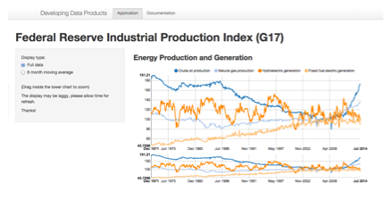
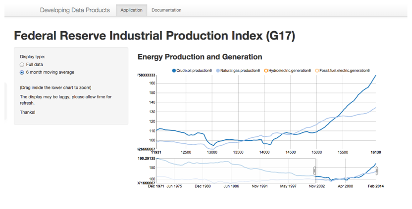

## Application Overview

This application is developed using Shiny Apps library and deployed on the RStudio ShinyApps server.

[https://hvera.shinyapps.io/EnergyProduction/](https://hvera.shinyapps.io/EnergyProduction/)
  

* Displays data from the Federal Reserve on oil and energy production
* Uses _interactive_ charts based on the D3 and the nvd3 rCharts support
* Allows selection and de-selection of specific series
* Interactive zooming of date ranges

 

--- .class #id 

## Source of data

The source of the data used in this application is:

[Data Link](http://www.federalreserve.gov/datadownload/Output.aspx?rel=G17&series=40c934df8880a37c309bcb363e69966d&lastObs=&from=01/01/1970&to=12/31/2014&filetype=csv&label=include&layout=seriescolumn)

Detailed explanation of the data series can be found at the Federal Reserve site:

[Industrial Production and Capacity Utilization - G.17](http://www.federalreserve.gov/releases/G17/default.htm)

From the Fed website:

_The production index measures real output and is expressed as a percentage of real output in a base year, currently 2007. The capacity index, which is an estimate of sustainable potential output, is also expressed as a percentage of actual output in 2007. The production indexes are computed as Fisher indexes since 1972; the weights are based on annual estimates of value added. The rate of capacity utilization equals the seasonally adjusted output index expressed as a percentage of the related capacity index._

--- class .id

## Moving Average display

The moving average is constructed using the `zoo` library `rollmean` function. Example:


```r
library(zoo)
x.Date <- as.Date(paste(2004, rep(1:4, 4:1), sample(1:28, 10), sep = "-"))
x <- zoo(rnorm(12), x.Date)
 
rollmean(x, 3)
```

```
##   2004-01-13   2004-01-14   2004-01-15   2004-02-03   2004-02-07 
## -0.397168037 -0.002649532  0.042274323  0.487672438  0.071784804 
##   2004-02-21   2004-03-12   2004-03-19 
##  0.025687758 -0.346605512  0.071324612
```

--- class .id

## Moving Average display within a date range

This image shows the display using the six-month moving average zoommed in to the most recent years.


 


